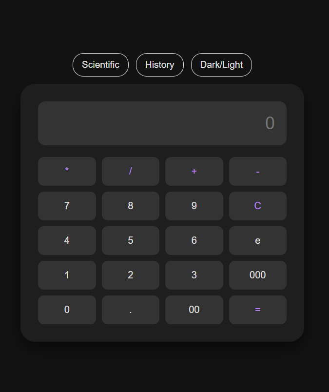
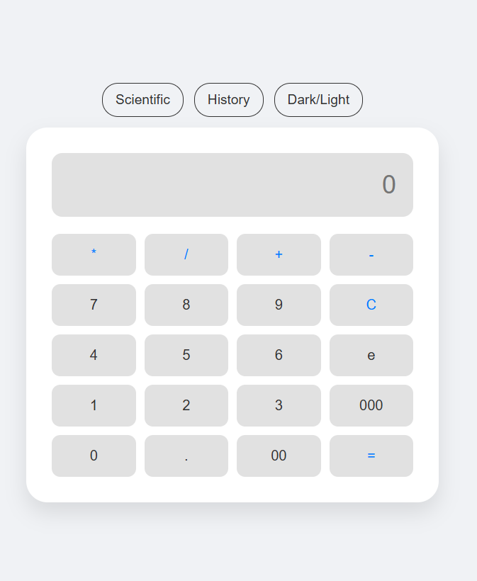
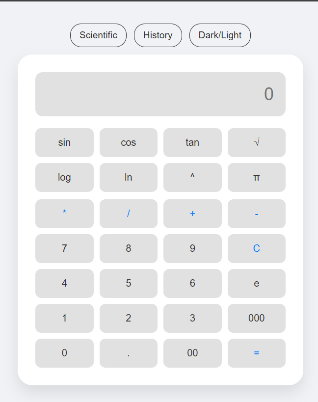
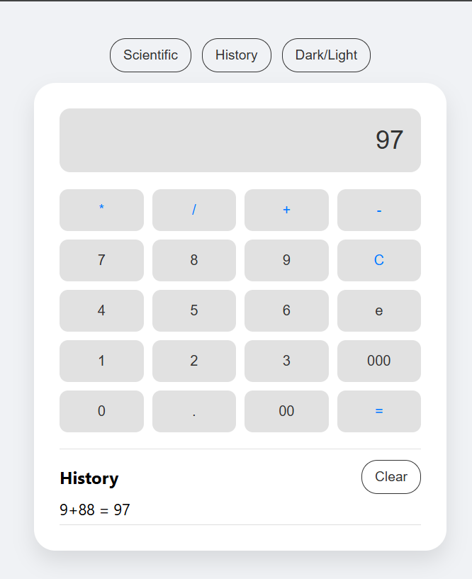
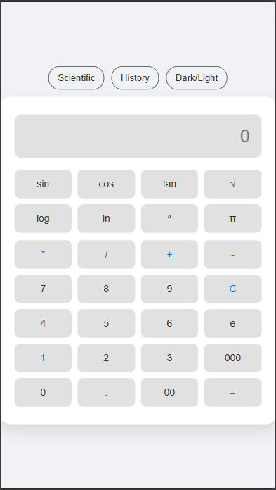

<div align="center">

# 🧮 Calculate ME

### A Modern, Responsive Scientific Calculator for the Browser

A clean, professional-grade browser calculator supporting both standard arithmetic and advanced scientific operations — with instant Dark/Light theming, calculation history, and a fully responsive layout.


-orange.svg)


</div>

---

## 📌 Project Overview

**Calculate ME** is a modern, browser-based calculator built with a clean, professional aesthetic. It supports standard arithmetic alongside a full scientific function suite, all wrapped in a responsive CSS Grid layout that adapts smoothly across desktop and mobile devices — with zero backend, zero dependencies, and zero build step.

---

## 📱 App Preview & Walkthrough

### 🌙 Dark Mode


The default Dark theme view — a sleek, low-glare interface built for comfortable use in low-light environments, with the CSS variable-driven theme engine handling instant, flicker-free color switching.

---

### ☀️ Light Mode


The same calculator instantly re-themed into a crisp Light mode. The toggle swaps the entire color palette via CSS variables in real time, with no page reload or layout shift.

---

### 🔬 Scientific Panel


Clicking the **Scientific** button reveals the advanced function panel with a smooth slide-in/slide-out transition, unlocking operations like sin, cos, tan, log, ln, power, square root, and the constants π and e.

---

### 📜 Calculation History


The **History** panel automatically logs previous calculations via `localStorage`, capped at the last 10 entries. History persists across page refreshes and browser restarts, with a one-click **Clear** option to reset the log.

---

### 📐 Responsive Layout


Built on a flexible CSS Grid system, Calculate ME reflows cleanly across screen sizes — from desktop monitors down to mobile devices — without sacrificing button spacing or usability.

---

## ✨ Key Features

- 🔬 **Scientific Suite** — Advanced functions including sin, cos, tan, log, ln, power (^), square root (√), and constants π and e
- 📐 **Responsive Design** — Flexible CSS Grid layout ensuring consistent usability across desktop and mobile
- 🎨 **Theme Engine** — Instant Dark/Light mode toggle powered by CSS variables
- ✨ **Dynamic Animations** — Smooth slide-in/out transition for the scientific panel, plus a subtle pulse animation on the result display when a calculation completes
- 📜 **History Tracking** — Automatically logs recent calculations via browser `localStorage`, persisting across refreshes and sessions

---

## 💾 History Implementation & Data Storage

Calculate ME uses browser **Storage APIs** instead of a traditional backend database (SQL/MongoDB), keeping the tool fast, simple, and privacy-first.

**Why `localStorage` is the "Pro" choice:**

- **Persistence** — Data remains available even after a refresh or browser close
- **Privacy** — Data never leaves the user's browser, sidestepping GDPR and external data-privacy concerns entirely
- **Simplicity & Speed** — Zero server-side code, fully local, and incredibly fast

**Technical details:**
- **Queue management:** History is capped at the last 10 entries using `.unshift()` and `.pop()` to keep the log clean and performant
- **Data handling:** Entries are stored as text via `JSON.stringify()` and retrieved via `JSON.parse()`

---

## 🛠️ Technical Implementation

| Aspect | Approach |
|---|---|
| **Event Handling** | Single delegated event listener on the container (more memory-efficient than per-button listeners) |
| **Math Logic** | JavaScript `Math` object methods for scientific operations |
| **Modularity** | Buttons mapped to operations via the `data-val` HTML attribute for easy future expansion |
| **Layout** | CSS Grid for structural robustness, avoiding scope clashes |

---

## 🛠️ Technology Stack

| Layer | Technology |
|---|---|
| **Structure** | HTML5 |
| **Styling** | CSS3 (Grid layout, CSS variables, keyframe animations) |
| **Logic** | Vanilla JavaScript (ES6+) |
| **Storage** | Browser `localStorage` API |

---

## 📂 Project Structure

```
Calculator/
├── assets/                      # Screenshots & static image assets
│   ├── Dark_Main_Screen.png
│   ├── Light_Main_Screen.png
│   ├── Scienntfic.png
│   ├── Calculat_And_History.png
│   └── Responsive.png
├── calculator.html                # Full app — structure, styling & logic
└── README.md
```

---

## 🚀 Usage Instructions

1. **Deployment:** Save/clone the source code as an `.html` file — no build step required
2. **Access:** Open `calculator.html` in any modern web browser
3. **Operation:**
   - **Standard Inputs** — Use the on-screen keypad
   - **Scientific Functions** — Click **Scientific** to reveal advanced functions
   - **Appearance** — Toggle **Dark/Light** to switch themes
   - **Calculation** — Press `=` to compute and trigger the result pulse animation
   - **History** — Click **History** to view past calculations; use **Clear** to reset the log

---

<div align="center">

*A fast, privacy-first, framework-free calculator built for both everyday and scientific use.*

</div>
